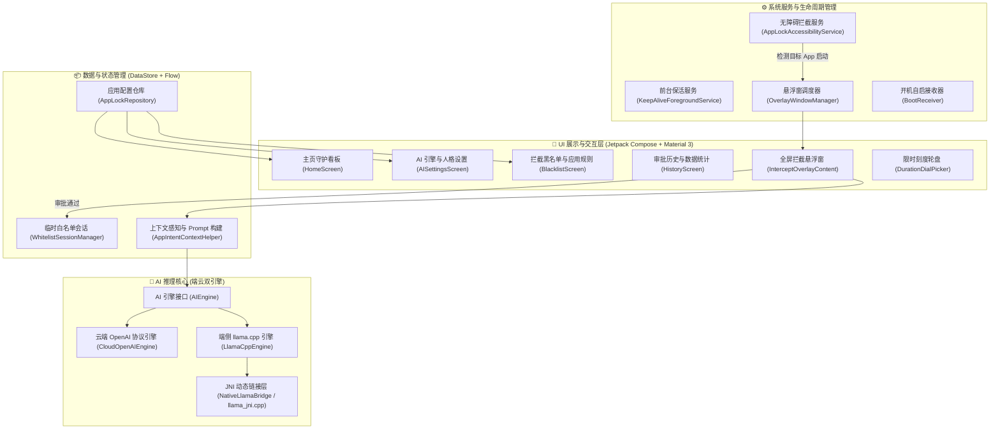
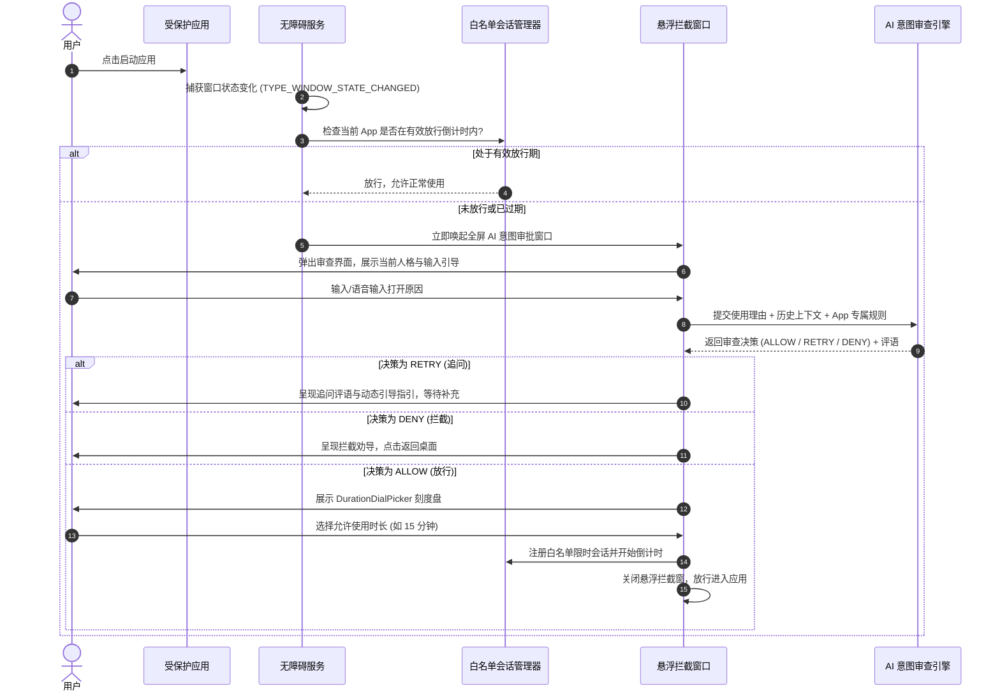

<div align="center">

# 🧠 AI 锁机自律 (AISelfDiscipline)

**拒绝无意识沉迷，让每一次打开都有清晰的目的**

一款基于 **Android 原生平台** 打造的端云双引擎 **AI 意图审查与防沉迷自律应用**。

[](CHANGELOG.md)
[-3DDC84?style=flat-square&logo=android&logoColor=white)](https://developer.android.com)
[](https://kotlinlang.org/)
[](https://developer.android.com/jetpack/compose)
[](https://github.com/ggerganov/llama.cpp)
[](LICENSE)

[功能特性](#-核心功能特性) • [技术架构](#-技术架构与工作原理) • [双引擎配置](#-ai-双引擎配置指南) • [构建指南](#-源码编译与运行) • [更新日志](CHANGELOG.md) • [常见问题](#-常见问题-faq)

</div>

---

## 📖 项目简介

在移动互联时代，我们常常因无聊、焦虑或条件反射无意识地点开社交、短视频与娱乐应用，数十分钟甚至数小时的时间在不知不觉中流逝。传统的锁机软件往往采用**生硬的一刀切定时拦截**或**机械的密码锁定**，既无法应对真正的突发正事，也容易被轻易卸载或破除。

**AI 锁机自律** 从“意图有意识性”出发：
当您尝试打开受保护的应用时，系统会唤起全屏沉浸式的 **AI 意图审查界面**。您需要向 AI 阐述本次打开应用的具体目的与预计任务。AI 审查官将结合目标应用功能、您预设的专属规则以及多轮追问，评估您的使用意图是否具体明确。只有正当理由才能获得限时放行，助您摆脱冲动消费注意力的恶性循环。

---

## ✨ 核心功能特性

### 1. 🤖 端云双引擎无缝切换
- **☁️ 云端大模型引擎（推荐）**：兼容 OpenAI API 规范，内置 **DeepSeek**、**通义千问 (Qwen)**、**硅基流动 (SiliconFlow)**、**OpenAI** 等主流预设，支持多服务商独立配置与思考链（Thinking Process）参数调节，情商极高、逻辑严密。
- **⚡ 端侧离线推理引擎**：基于 `C++20` + `JNI` 深度集成 `llama.cpp`，支持在手机本地直接加载运行 **Qwen2.5-3B** 等 GGUF 格式量化大模型。完全离线运行、零网络依赖、零隐私泄露风险。

### 2. 🛡️ 智能意图多轮审查与 3 级决策流
- 告别机械的非黑即白判定，采用多轮上下文对话审查：
  - `ALLOW`（放行）：意图明确具体、与应用契合，准予设定限时使用权限。
  - `RETRY`（追问）：目的较为模糊时，审查官将针对性追问并动态提炼一句话输入指引（`guidance_tip`）。
  - `DENY`（驳回）：无明确目的、无聊消遣或动机与应用不符，予以拦截并给出劝导建议。
- 细粒度归因分类：明确目的、模糊目的、冲动消遣、无意识习惯、应用不符、其他。

### 3. 🎭 多元审查官人格与自定义系统
内置 4 种性格迥异的审查官人设，并支持自由创建与管理专属审查官：
| 审查官人格 | 风格定位 | 核心特点 |
| :--- | :--- | :--- |
| **中立意图判断器** | 客观冷静 (默认推荐) | 不做道德评判与心理诊断，只严格审查目的具体性 |
| **严厉教官** | 铁面无私 | 军事化严肃口吻，严词训诫摸鱼借口，正事痛快放行 |
| **理性管家** | 逻辑严密 | 专业时间管理顾问口吻，启发澄清任务产出与时间预算 |
| **毒舌损友** | 辛辣幽默 | 一针见血吐槽敷衍借口，幽默风趣击碎惰性 |
| **自定义审查官** | 自由定制 | 支持自定义 System Prompt 与核心审查任务 |

### 4. 🎯 单 App 专属规则清单
支持为特定应用（如微信、小红书、抖音、B站等）单独配置：
- **放行白名单场景**（如：微信查收工作通知、B站搜索编程教程）
- **禁止黑名单场景**（如：朋友圈闲逛、无目的滑动推荐流）

### 5. ⏱️ 轮盘限时放行与会话守护
- 审批通过后，通过交互细腻的 **`DurationDialPicker` 刻度转盘** 设定本次允许使用时长（1~120 分钟）。
- 在倒计时有效期内畅快使用目标应用；时间耗尽后自动恢复拦截保护。

### 6. 📱 Android 14+ 深度适配与后台保活
- **无障碍监听**：`AppLockAccessibilityService` 毫秒级捕获前台应用切换事件。
- **前台守护服务**：`KeepAliveForegroundService` 严格遵循 Android 14 `specialUse` 前台服务类型规范。
- **全屏悬浮拦截窗**：基于 `SYSTEM_ALERT_WINDOW` 与 Jetpack Compose 实现的沉浸式全屏拦截覆盖层。
- **自启动保活**：开机自启广播接收器（`BootReceiver`）保障守护常驻。

---

## 🏗️ 技术架构与工作原理

### 系统分层架构



### 拦截审批时序流程



---

## ⚙️ AI 双引擎配置指南

### 1. 云端大模型配置（推荐）

进入应用底栏 **「AI 设置」** 页面，选择 **「☁️ 云端大模型」**：

1. **选择服务商预设**：
   - **DeepSeek**：默认 Base URL `https://api.deepseek.com`，模型 `deepseek-chat`。
   - **通义千问 Qwen**：默认 Base URL `https://dashscope.aliyuncs.com/compatible-mode/v1`，模型 `qwen-plus`。
   - **硅基流动**：默认 Base URL `https://api.siliconflow.cn/v1`，模型 `deepseek-ai/DeepSeek-V3`。
   - **OpenAI**：默认 Base URL `https://api.openai.com/v1`，模型 `gpt-4o-mini`。
   - **自定义 OpenAI 兼容**：支持填写自建 OneAPI、NewAPI 或第三方中转地址与自定义模型名。
2. **填入 API Key** 并保存。
3. 可按需开启 **「深度思考 / 思考过程」** 选项并配置对应的参数键名（如 `enable_thinking` 或 `thinking`）。

### 2. 端侧离线引擎配置（GGUF）

1. **下载推荐模型**：
   推荐下载由 Qwen 官方发布的轻量指令量化模型，例如：
   - [Qwen2.5-3B-Instruct-GGUF (q4_k_m)](https://huggingface.co/Qwen/Qwen2.5-3B-Instruct-GGUF)（约 1.9 GB，平衡速度与推理能力）
2. **推送到手机存储**：
   将下载好的 `.gguf` 文件存放在手机本地路径（例如 `/sdcard/Download/qwen2.5-3b-instruct-q4_k_m.gguf`）。
3. **在应用中指定模型路径**：
   进入 **「AI 设置」** ➔ 切换到 **「⚡ 端侧离线引擎」** ➔ 输入或选择本地模型绝对路径。

---

## 🛠️ 源码编译与运行

### 环境要求

- **Android Studio**：Ladybug (2024.2.1) 或更高版本
- **JDK**：OpenJDK 11 或 17 / 21
- **Android SDK**：
  - `compileSdk`: 37 (Android 15 / VanillaIceCream Preview)
  - `minSdk`: 34 (Android 14)
  - `targetSdk`: 37
- **Android NDK**：25.x 或更高版本（用于编译 C++20 JNI `llama_jni` 原生库）
- **CMake**：3.22.1+

### 构建步骤

1. **克隆项目到本地**：
   ```bash
   git clone https://github.com/MarksXie/AISelfDiscipline.git
   cd AISelfDiscipline
   ```

2. **配置 Android SDK 与 NDK 路径**：
   在项目根目录下确保 `local.properties` 包含正确的 SDK 与 NDK 路径：
   ```properties
   sdk.dir=C\:\\Users\\<YourUsername>\\AppData\\Local\\Android\\Sdk
   ndk.dir=C\:\\Users\\<YourUsername>\\AppData\\Local\\Android\\Sdk\\ndk\\<ndk-version>
   ```

3. **使用 Gradle 构建 Debug APK**：
   - **Windows (PowerShell)**:
     ```powershell
     .\gradlew.bat assembleDebug
     ```
   - **Linux / macOS**:
     ```bash
     ./gradlew assembleDebug
     ```

4. **安装到连接的设备**：
   ```bash
   adb install -r app/build/outputs/apk/debug/app-debug.apk
   ```

---

## 📂 工程目录结构

```text
app/src/main/
├── AndroidManifest.xml                  # 清单文件 (权限、服务与广播注册)
├── cpp/                                 # C++20 / JNI 端侧推理核心
│   ├── CMakeLists.txt                   # CMake 编译配置
│   ├── include/                         # llama.cpp 与 C++ 头文件
│   └── llama_jni.cpp                    # JNI 桥接实现 (模型加载/推理/释放)
├── java/com/example/myapplication/
│   ├── AppApplication.kt                # 全局 Application 入口
│   ├── MainActivity.kt                  # 主 Activity (Compose 导航与权限初始化)
│   ├── ai/                              # AI 引擎实现层
│   │   ├── AIEngine.kt                  # 统一 AI 引擎接口定义
│   │   ├── AppIntentContextHelper.kt    # 意图上下文分析与 Prompt 装配器
│   │   ├── CloudOpenAIEngine.kt         # 云端 OpenAI 协议兼容引擎
│   │   ├── LlamaCppEngine.kt            # 端侧 llama.cpp 引擎管理
│   │   └── NativeLlamaBridge.kt         # JNI 原生方法桥接声明
│   ├── data/                            # 数据模型与仓库层
│   │   ├── model/
│   │   │   ├── AIModels.kt              # 决策枚举、服务商配置、人格 Profile 数据类
│   │   │   ├── AppInfo.kt               # 已安装应用信息模型
│   │   │   ├── ApprovalRecord.kt        # 审批历史记录数据类
│   │   │   ├── ChangelogModels.kt       # 版本更新日志与历史变更数据模型
│   │   │   └── StatisticsModels.kt      # 自律统计、AI 复盘报告数据模型
│   │   └── repository/
│   │       ├── AppLockRepository.kt     # DataStore 偏好存储与响应式数据源
│   │       └── WhitelistSessionManager.kt # 限时放行白名单会话倒计时管理
│   ├── receiver/
│   │   └── BootReceiver.kt              # 开机自启动广播接收器
│   ├── service/                         # 系统服务层
│   │   ├── AppLockAccessibilityService.kt # 无障碍前台应用拦截服务
│   │   ├── KeepAliveForegroundService.kt  # Android 14 规范前台保活服务
│   │   ├── OverlayWindowManager.kt        # 全屏拦截悬浮窗控制器
│   │   └── StatsReportWorker.kt           # 后台定时自律复盘报告 Worker
│   ├── ui/                              # Compose UI 层
│   │   ├── components/
│   │   │   └── ChangelogDialog.kt       # 版本演进与更新日志对话框组件
│   │   ├── overlay/
│   │   │   ├── DurationDialPicker.kt    # 刻度转盘使用时长选择器
│   │   │   └── InterceptOverlayContent.kt # 全屏拦截对话审批弹窗
│   │   ├── screens/
│   │   │   ├── AISettingsScreen.kt      # AI 双引擎与审查官人格设置页
│   │   │   ├── BlacklistScreen.kt       # 黑名单应用管理与规则定制页
│   │   │   ├── HomeScreen.kt            # 守护主页看板
│   │   │   ├── PermissionGuideScreen.kt # 系统必要权限授权引导页
│   │   │   ├── StatisticsScreen.kt      # 自律统计复盘与流水看板
│   │   │   └── stats/                   # 统计分析子模块 (图表/报告/卡片)
│   │   └── theme/                       # Material 3 陶土奶咖主题与配色
│   └── util/
│       ├── DeviceInfoHelper.kt          # 设备信息与系统状态工具类
│       └── StatsPeriodHelper.kt         # 统计周期计算与级联聚合工具
└── res/                                 # 资源目录 (图标、布局、多语言、配置)
```

---

## ❓ 常见问题 (FAQ)

<details>
<summary><b>Q1: 开启后目标 App 偶发没有被拦截，应该如何排查？</b></summary>
<br>

1. **检查无障碍服务状态**：进入系统「设置」➔「无障碍」，确认「AI锁机自律」服务处于开启状态。部分国内定制系统在应用更新后可能会静默重置无障碍权限。
2. **检查悬浮窗权限**：确保已授予「在其他应用上层显示」权限。
3. **加入电池优化白名单**：在系统设置中将本应用设置为「无限制」或加入电池保护白名单，防止后台被系统深度省电策略杀掉。
</details>

<details>
<summary><b>Q2: 端侧离线模型加载失败或闪退怎么办？</b></summary>
<br>

1. **存储权限**：确保应用已被授予「管理所有文件」或读取外部存储权限。
2. **路径准确性**：确认填入的模型路径准确无误且文件扩展名为 `.gguf`。
3. **RAM 内存限制**：3B 参数量的 Q4_K_M 模型通常需要约 2.2GB 运行内存，请确保设备剩余运行内存充足。
</details>

<details>
<summary><b>Q3: 云端大模型为什么建议关闭思考过程或设置较低的 Max Tokens？</b></summary>
<br>

在应用拦截场景下，用户期望在 **1~2 秒内** 获得审查反馈以决定是否放行。开启深度思考模式（如 DeepSeek-R1 等推理模型）会显著增加首字输出延迟（TTFT）。建议日常使用时采用常规聊天模型（如 `deepseek-chat` 或 `qwen-plus`），以获得最极致的秒级响应体验。
</details>

---

## 🤝 参与贡献

欢迎对本项目提出建议、反馈 Bug 或提交 Pull Request！

1. Fork 本仓库并新建功能分支：`git checkout -b feature/AmazingFeature`
2. 提交您的修改：`git commit -m 'Add some AmazingFeature'`
3. 推送到远程分支：`git push origin feature/AmazingFeature`
4. 创建并提交 Pull Request。

---

## 📄 开源许可证

本项目基于 **[MIT License](LICENSE)** 协议开源。
